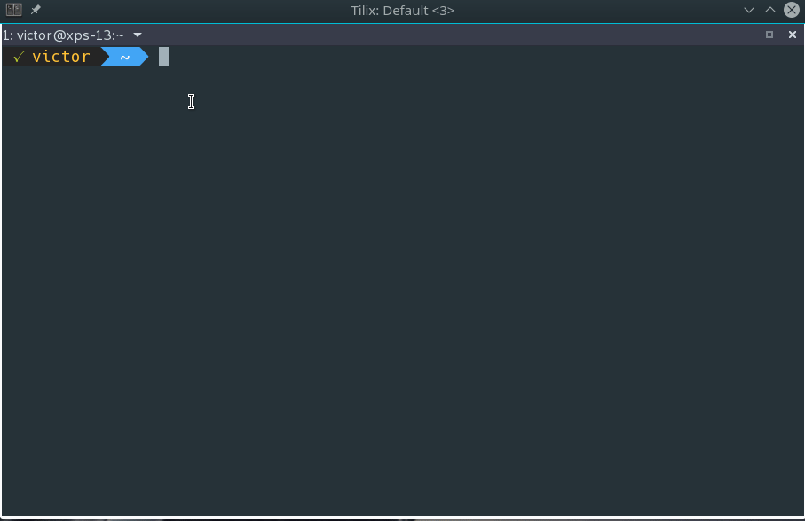
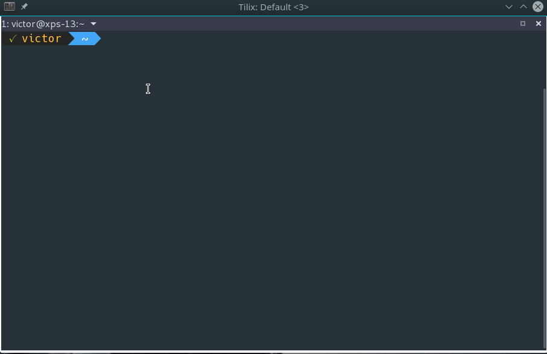
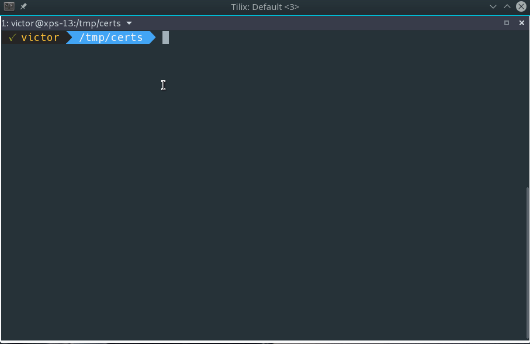
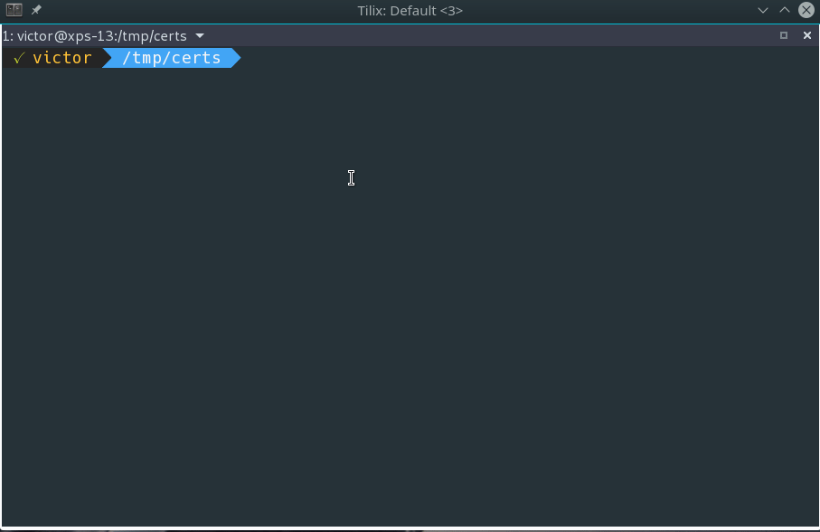

ssl-tools
===

A set of Bash tools to deal with various SSL certificate files.

Commands
===

### Connect Via SSL

```
ssl-tool [connect|download] [server] {-p port|-c certificate.cer}
```

Test SSL connection to a server. You can specify a port (if different than default) and a CA certificate.



### Download Certs

```
ssl-tool [connect|download] [server] {-p port|-c certificate.cer}
```

Downloads the server certificate from the specified server. You can specify a port (if different than default) and a CA certificate.



### View Files

```
ssl-tool view [file]
```

Can be used to view the following file types:

* Certificates
  - .cer, .crt, .pem, .der
* Certficate Signing Requests
  - .csr
* PKCS12 and PKCS#7 bundles
  - .p7b, .p12

#### Examples

**View `cer, crt` files (in both `pem` and `der` formats).**



**View `csr` files.**


### Convert

```
ssl-tool convert [file] [format]
```

Can be used to convert certificate files between different formats:

* .pem to .der
* .pem to .cer (ASCI and DER)
* .der to .pem
* .der to .cer (ASCI and DER)
* .cer to .pem
* .cer to .der

#### Examples

**Convert `CER` to `DER`**


**Convert `DER` to `CER (ASCI)`**



### Extract

```
ssl-tool extract [file]
```

Extracts certificates and keys from .p7b and .p12.

### Check

```
ssl-tool check [key file]
ssl-tool check [cer or pem file] date
```

Checks integrity of key or expire date for .per or .cer certificates.

Install
===

Download `ssl-tools.bash` and source it on your shell or `${HOME}/.bashrc`.

```
wget https://raw.githubusercontent.com/victorbrca/ssl-tools/master/ssl-tools.bash
```
